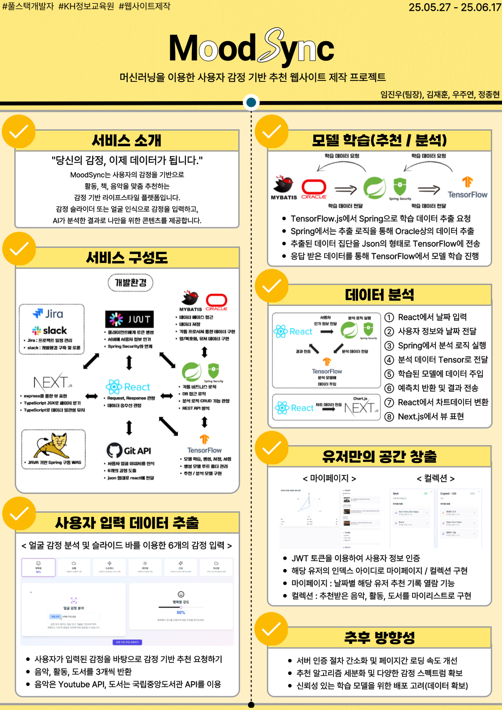

# 🧠 MoodSync
## Emotion-based Recommendation System

**MoodSync**는 사용자의 감정 데이터를 기반으로 맞춤형 활동, 책, 음악을 추천하는 통합 감정 분석 플랫폼입니다.  
사용자의 감정 상태를 정량화하고, AI 모델을 통해 분석하며, 정서적 웰빙을 위한 맞춤형 콘텐츠를 제공합니다.

---

---

<h2>🌟 프로젝트 개요</h2>

- **프로젝트명**: MoodSync  
- **목표**: 감정 데이터 기반의 맞춤형 콘텐츠 추천 및 사용자 감정 분석  
- **주요 기능**:  
  - 감정 슬라이더/카메라 인식을 통한 감정 입력  
  - 활동, 도서, 음악 추천 (감정별 100개씩)  
  - 사용자 감정 패턴 시계열 분석  
  - 감정 기반 사용자 군집화 (Clustering)  
  - 사용자 이탈 가능성 예측 (Churn Prediction)  

---

🛠️ 기술 스택

### 📌 Frontend
- **Next.js**
- **TypeScript**
- **Tailwind CSS**
- **TensorFlow.js (감정 예측)**

### 📌 Backend
- **Spring Boot**
- **MyBatis + Oracle DB**
- **RESTful API**
- **JWT 인증 시스템**

### 📌 데이터 및 모델링
- 사용자 감정 입력값 (행복, 슬픔, 스트레스, 차분함, 흥분, 피곤함)
- 예측 모델: TensorFlow.js 기반의 Multi-class Classification
- 이탈 분석 모델: 사용자 활동 수, 피드백, 최근 활동 기반 Churn 예측

---

📊 핵심 기능 설명

### ✅ 감정 기반 추천 시스템
- 6가지 감정에 따라 콘텐츠 추천
- DB에 저장된 100개의 추천 활동/책/음악 리스트 제공

### ✅ 감정 예측 모델
- 감정 입력(6차원 벡터) → 대표 감정 클래스 예측
- Express + TensorFlow.js 서버 구성

### ✅ 사용자 분석 기능
- 감정 이력 시계열 분석
- 감정 유형별 사용자 군집화 (K-means 활용)
- 최근 활동 및 피드백 기반 이탈 가능성 예측

---

## 🎬 시연 영상

  
전체적인 UI/UX 보기

  <iframe width="560" height="315" src="https://www.youtube.com/watch?v=yigIkC7Lgto" frameborder="0" allowfullscreen></iframe>

  
추천 요청하기 보기

  <iframe width="560" height="315" src="https://www.youtube.com/embed/영상ID" frameborder="0" allowfullscreen></iframe>

  
마이페이지 보기

  <iframe width="560" height="315" src="https://www.youtube.com/embed/영상ID" frameborder="0" allowfullscreen></iframe>

  
컬렉션 보기

  <iframe width="560" height="315" src="https://www.youtube.com/embed/영상ID" frameborder="0" allowfullscreen></iframe>

  
관리자페이지 보기

  <iframe width="560" height="315" src="https://www.youtube.com/embed/영상ID" frameborder="0" allowfullscreen></iframe>

  
문의하기 보기

  <iframe width="560" height="315" src="https://www.youtube.com/embed/영상ID" frameborder="0" allowfullscreen></iframe>

  
피드백 보기

  <iframe width="560" height="315" src="https://www.youtube.com/embed/영상ID" frameborder="0" allowfullscreen></iframe>

